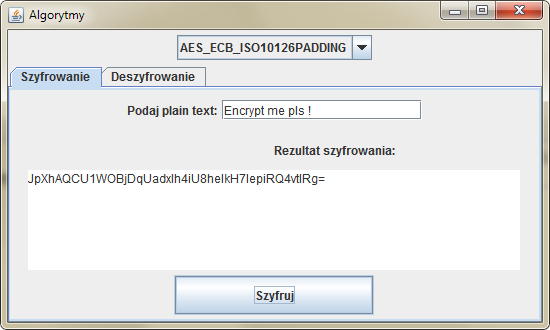
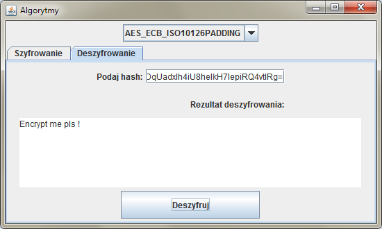

# Encryption & Decryption application
> Encrypt & Decrypt plain text uses 30 different hashes algorithms. This application is graphic UI and uses SWING Java library.

## Table of contents
* [General info](#general-info)
* [Screenshots](#screenshots)
* [Technologies](#technologies)
* [Setup](#setup)
* [Features](#features)
* [Status](#status)
* [Info](#info)

## General info
The project is divided into several packages:
* core: contains the basic Encryptable interface that is the basis for all algorithms.
* encoder: contains the Encoder class, which aggregates all builders that can build any algorithm.
* builders: contains individual Builders (design pattern) that build a specific algorithm (eg DES, AES).
* callbacks, threads: contains interfaces and classes used for asynchronous calls (multi-threaded) - they are not used in this project, but ready for use for multithreaded applications.
* hashes: hash logic.
* methods: provides various encryption methods for a given algorithm. Each class in the methods package has an enum Method, which further specifies what the encryption mode and padding is.
* ui: the visual layer of the application.

## Screenshots

		--->

## Technologies
* Java (Swing)

## Setup
The program starts its operation from the `main ()` method in the `Runner` class. The main program window is initialized `(MainFrame)` and the display method shows them to the screen by calling `setVisible (true)` on the JFrame object from which `MainFrame` inherits.

`public class Runner {
     public static void main (String [] args) {
         SwingUtilities.invokeLater (Runner :: runApp);
     }
     private static void runApp () {
         new MainFrame (). display ();
     }
}`

The `main` method of running the program uses the `SwingUtilities.invokeLater` method to prevent blocking of the `main` thread of the processing program and separation from the UI thread.

## Features
List of features ready:
* Encryption & Decryption options parallely.
* Creates a list with 30 algorithms in the form JOptionPane:
     `JAlgorithmList algorithmList = new JAlgorithmList (this);
     getContentPane (). add (algorithmList);`
* Warning messages for other critical fields.

## Status
Project is: _finished_

## Info
Powered by Adrian Czarniecki
